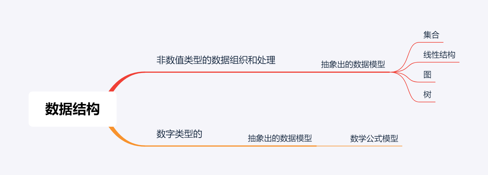

## Python版本的数据结构

为了方便自己学习记忆之前学过的知识，这次自己用Python重写一下常见的数据结构😀，里面每个py文件是一种数据数据结构的例子，文件内的类的基本结构是：

- 1）数据结构的接口类
- 2）数据结构的实现类
- 3）unittest库的测试类（用来验证结果是否正确的）

## 首先什么是数据结构

用计算机解决任何问题都离不开程序设计，程序涉及的实质是**数据表示**和**数据处理**。   

数据要能被处理首先要能够存储在计算机的内存中，这项任务称为**数据标识**，核心就是**数据结构**，一个实际问题的求解必须满足各项处理要求，这项任务称为**数据处理**，核心就是**算法**。  

​    

知道了**数据结构**和**算法**，我们才可以更好的记忆和学习数据结构，数据结构的根本作用就是   ——》 描述数据集内数据的存储逻辑关系，对非数值类型的数据组织和处理抽象出的数据模型。😂

------

# DataStruct 

数据结构文件夹 python实现

[所有的文件在这儿](https://github.com/realzhengyiming/data-structure_byPython/tree/master/DataStruct/*py)

# Model_Approach

设计模式文件夹 python实现

> 参考《数据结构（c++)版（第二版）》